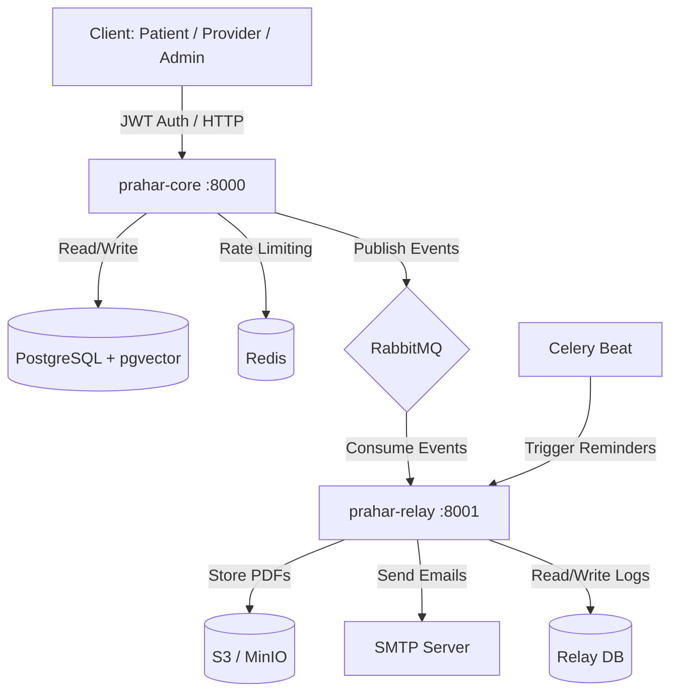

# Prahar Care: Healthcare Management System with AI Assistant

Welcome to the documentation for **Prahar Care**, a modern, event-driven, and AI-assisted Healthcare Management System. This documentation outlines the backend architecture, technology stack, data models, and implementation details for the system.

---

## System Overview

Prahar Care is designed to streamline healthcare operations, including patient and provider management, appointment scheduling, prescription handling, automated reminders, and AI-powered clinical assistance. 

The system is split into two primary backend services:
1. **`prahar-core`**: Handles core business logic, user authentication, CRUD operations, search, and AI features.
2. **`prahar-relay`**: Handles asynchronous, non-blocking tasks such as PDF generation, S3 document uploads, email notifications, and scheduled reminders.

---

## Technology Stack

| Layer | Technology | Purpose |
| :--- | :--- | :--- |
| **API Framework** | FastAPI | High-performance, asynchronous API endpoints, automatic OpenAPI documentation, and Pydantic validation. |
| **Database** | PostgreSQL 16 | Relational data storage, exclusion constraints for scheduling, and JSONB support. |
| **Vector DB** | pgvector (Postgres extension) | Storing and querying clinical embeddings for RAG. |
| **ORM** | SQLAlchemy 2.0 (Async) | Type-safe, asynchronous database interactions and polymorphic models. |
| **Migrations** | Alembic | Schema evolution and migrations without data loss. |
| **Message Queue** | RabbitMQ | Event-driven communication between `prahar-core` and `prahar-relay`. |
| **Cache & Broker** | Redis | Rate limiting (prescription abuse prevention) and Celery message broker. |
| **Task Queue** | Celery + Celery Beat | Scheduled jobs (reminders) and background task execution. |
| **Object Storage** | AWS S3 (Local: MinIO) | Storing generated PDFs (prescriptions, visit summaries) with pre-signed URLs. |
| **PDF Engine** | WeasyPrint | HTML-to-PDF rendering for medical documents. |
| **AI / LLM** | LLM + pgvector | Retrieval-Augmented Generation (RAG) and tool-calling clinical agent. |
| **Testing** | pytest | Unit and integration testing for scheduling conflicts and business rules. |
| **Containerization** | Docker Compose | Multi-container orchestration for local development and deployment. |

---

## System Architecture

The system follows an event-driven architecture to ensure that user-blocking operations are synchronous and fast, while heavy or external operations (like PDF generation, email sending, and reminders) are handled asynchronously.

---

## Codebase Layering

Within each service, code is organized into distinct layers to separate concerns:

1. **API Router (`app/api/`)**: Handles HTTP requests, parses query parameters, and returns JSON responses. It contains no business logic.
2. **Service Layer (`app/services/`)**: Implements business rules, manages database transactions, and publishes events to RabbitMQ.
3. **Repository Layer (`app/repositories/`)**: Encapsulates database queries. It contains no business logic or conditional rules.
4. **Model Layer (`app/models/`)**: Defines SQLAlchemy models and domain-specific behaviors (e.g., polymorphic methods like `check_in()` or `complete()`).
5. **Schemas (`app/schemas/`)**: Pydantic models for request validation and response serialization.

---

## Documentation Index

To explore specific parts of the system, refer to the following guides:

* [**Architecture & Event Flow**](architecture.md): Detailed service boundaries, event-driven workflows, and layering.
* [**Database & Migrations**](database.md): Data models, relationships, soft deletes, polymorphic inheritance, and Alembic migrations.
* [**Authentication & RBAC**](auth_rbac.md): JWT authentication, role-based access control, and FastAPI dependencies.
* [**Appointments & Scheduling**](appointments.md): Appointment types, scheduling logic, and race-condition prevention using Postgres exclusion constraints.
* [**Prescriptions & Rate Limiting**](prescriptions.md): Prescription creation, dosage validation, and Redis-based rate limiting.
* [**Reminders & Document Generation**](reminders_documents.md): PDF rendering, S3 storage, Celery Beat reminders, and RabbitMQ event relay.
* [**AI Features (RAG & Agent)**](ai_features.md): Retrieval-Augmented Generation with pgvector and the tool-calling clinical agent.
* [**Folder Structure**](folder_structure.md): Quick reference for the purpose of each directory and file in the codebase.
