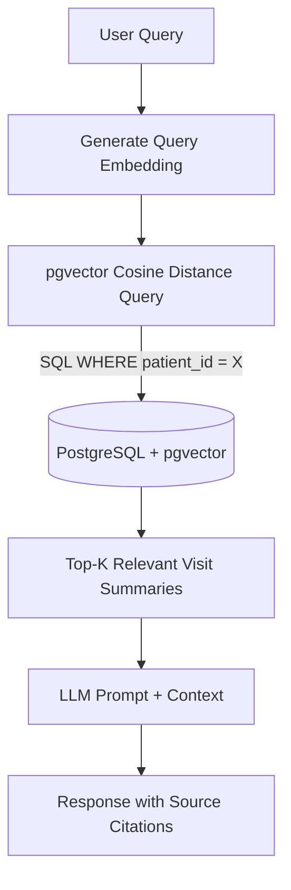
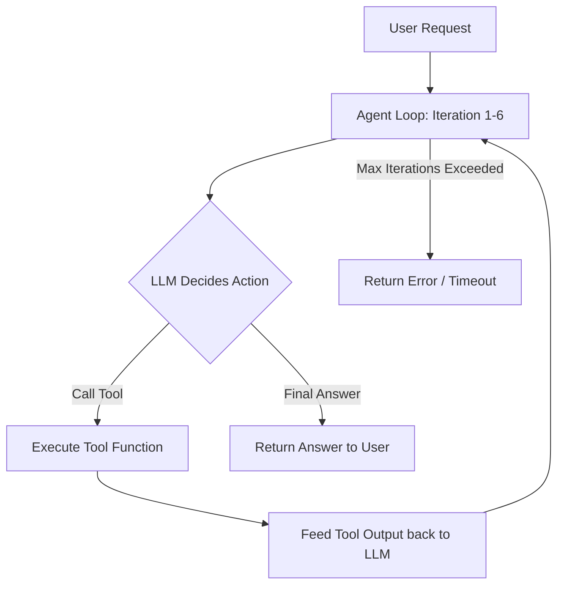

# AI Features: RAG & Tool-Calling Agent

Prahar Care integrates advanced AI capabilities directly into the clinical workflow. These features include a secure Retrieval-Augmented Generation (RAG) system for patient history Q&A and a tool-calling clinical agent to automate administrative tasks.

---

## Retrieval-Augmented Generation (RAG)

The RAG system allows providers to ask questions about a patient's medical history (e.g., *"Has this patient ever been prescribed penicillin?"* or *"What were the patient's vitals during their last visit?"*).

### Security & Privacy: Patient-Level Filtering
To comply with healthcare privacy regulations (e.g., HIPAA), the system enforces strict data isolation. A patient's query can **only** retrieve documents belonging to that specific patient. 

Instead of performing a global vector search and filtering the results in Python (which is insecure and inefficient), the system applies a SQL `WHERE` clause filter on `patient_id` **during** the vector search query.



### Implementation

1. **Database Schema (`visit_embeddings` table)**:
   ```python
   class VisitEmbedding(Base):
       __tablename__ = "visit_embeddings"
       
       id: Mapped[int] = mapped_column(primary_key=True)
       patient_id: Mapped[int] = mapped_column(ForeignKey("patients.id"), nullable=False, index=True)
       visit_summary_id: Mapped[int] = mapped_column(ForeignKey("visit_summaries.id"), nullable=False)
       content: Mapped[str] = mapped_column(Text, nullable=False)
       embedding: Mapped[list[float]] = mapped_column(Vector(1536), nullable=False) # 1536-dim for OpenAI embeddings
   ```

2. **Retrieval Query**:
   We use the `cosine_distance` operator (`<->`) provided by `pgvector` to find the most similar visit summaries, restricted to the target patient:
   ```python
   # app/ai/rag/retriever.py
   from pgvector.sqlalchemy import cosine_distance
   from sqlalchemy import select

   async def retrieve_relevant_summaries(
       db: AsyncSession, 
       patient_id: int, 
       query_vector: list[float], 
       limit: int = 3
   ) -> list[VisitEmbedding]:
       stmt = (
           select(VisitEmbedding)
           .where(VisitEmbedding.patient_id == patient_id) # Strict patient-level filter
           .order_by(VisitEmbedding.embedding.cosine_distance(query_vector))
           .limit(limit)
       )
       result = await db.execute(stmt)
       return result.scalars().all()
   ```

3. **LLM Prompt & Citations**:
   The retrieved summaries are formatted into the LLM prompt. The LLM is instructed to answer the question and cite the specific `visit_summary_id` or `visit_date` for each fact it states.

---

## Tool-Calling Clinical Agent

The clinical agent is an autonomous assistant that can perform tasks on behalf of providers and patients (e.g., finding open slots, scheduling appointments, or checking availability).

### Agent Loop
The agent operates in a loop, deciding which tools to call based on the user's request. To prevent infinite loops and control API costs, the loop is capped at a maximum of **6 iterations**.



### Available Tools
Tools are standard Python functions decorated or registered so the LLM understands their schema and purpose.

```python
# app/ai/agent/tools.py

async def find_earliest_slot(specialization: str, after: datetime) -> dict:
    """
    Finds the earliest available appointment slot for a given provider specialization.
    """
    return await appointment_service.find_earliest_slot(specialization, after)

async def book_appointment(patient_id: int, provider_id: int, start: datetime, reason: str) -> dict:
    """
    Books a new appointment for a patient.
    """
    appointment = await appointment_service.schedule_appointment(...)
    return {"status": "success", "appointment_id": appointment.id}
```

### Runner Implementation
The runner coordinates the interaction with the LLM and executes the tools:

```python
# app/ai/agent/runner.py
async def run_agent(user_prompt: str, patient_id: int) -> str:
    messages = [{"role": "user", "content": user_prompt}]
    tools = get_registered_tools()
    
    for iteration in range(6):
        # 1. Call LLM with available tools
        response = await llm.chat(messages=messages, tools=tools)
        
        # 2. Check if LLM wants to call a tool
        if not response.tool_calls:
            return response.content # Final answer
            
        # 3. Execute tool calls
        for tool_call in response.tool_calls:
            tool_name = tool_call.name
            tool_args = tool_call.arguments
            
            # Inject context (e.g., patient_id) if required by the tool
            if "patient_id" in tool_args:
                tool_args["patient_id"] = patient_id
                
            tool_result = await execute_tool(tool_name, tool_args)
            
            # Append tool result to message history
            messages.append(response.message)
            messages.append({
                "role": "tool", 
                "tool_call_id": tool_call.id, 
                "content": str(tool_result)
            })
            
    raise AgentTimeoutError("Agent exceeded maximum iteration limit of 6 steps")
```
