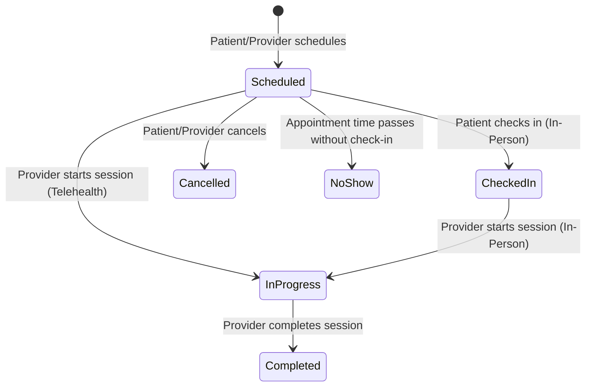

# Appointments & Scheduling

The appointment scheduling system is a critical component of Prahar Care. It handles scheduling, status transitions, and prevents double-booking using a combination of application-level checks and database-level constraints.

---

## Appointment Lifecycle

An appointment transitions through several states during its lifecycle:



* **`scheduled`**: The appointment is booked and confirmed.
* **`checked_in`**: The patient has arrived at the clinic (applicable to in-person appointments).
* **`in_progress`**: The consultation is currently active.
* **`completed`**: The consultation is finished, and a visit summary has been generated.
* **`cancelled`**: The appointment was cancelled before the scheduled start time.
* **`no_show`**: The patient failed to attend the appointment.

---

## Polymorphic Behavior

Appointments are modeled using Single-Table Inheritance (STI) in SQLAlchemy. This allows us to define type-specific behavior on the models themselves.

For example, checking in behaves differently depending on whether the appointment is in-person or telehealth:

```python
class Appointment(Base, TimestampMixin, SoftDeleteMixin):
    # ... common fields ...
    
    def check_in(self) -> None:
        raise NotImplementedError("Subclasses must implement check_in")

class InPersonAppointment(Appointment):
    room_number: Mapped[str | None] = mapped_column(String(20))

    def check_in(self) -> None:
        if self.status != AppointmentStatus.SCHEDULED:
            raise DomainError("Can only check in scheduled appointments")
        self.status = AppointmentStatus.CHECKED_IN.value
        self.checked_in_at = utcnow()

class TelehealthAppointment(Appointment):
    meeting_link: Mapped[str | None] = mapped_column(String(500))

    def check_in(self) -> None:
        # Telehealth appointments bypass the checked_in state and go straight to in_progress
        if self.status != AppointmentStatus.SCHEDULED:
            raise DomainError("Can only start scheduled appointments")
        self.status = AppointmentStatus.IN_PROGRESS.value
        self.checked_in_at = utcnow()
```

---

## Conflict Detection & Race Condition Prevention

To prevent a provider from being double-booked, the system uses a two-tier conflict detection strategy:

### 1. Application-Level Check (Fast & Informative)
Before attempting to write to the database, the service layer queries the repository to check for overlapping appointments. This allows us to return a clean, user-friendly error message.

```python
# app/services/appointment.py
async def schedule_appointment(self, data: AppointmentCreate) -> Appointment:
    # Check for overlaps
    has_overlap = await self.repo.has_overlap(
        provider_id=data.provider_id,
        start=data.scheduled_start,
        end=data.scheduled_end
    )
    if has_overlap:
        raise ConflictError("Provider is already booked during this time slot")
        
    # Proceed to create appointment
    ...
```

### 2. Database-Level Exclusion Constraint (Safety Net)
If two requests attempt to book the same provider at the exact same millisecond, the application-level check might pass for both (due to read-committed isolation levels). 

To prevent this race condition, the database enforces a `gist` exclusion constraint (`ex_appt_no_provider_overlap`). If a race condition occurs, the database throws an `IntegrityError`, which the service layer catches and handles:

```python
# app/services/appointment.py
try:
    await self.repo.create(appointment)
except IntegrityError as e:
    if "ex_appt_no_provider_overlap" in str(e):
        raise ConflictError("Provider was booked by another user. Please choose another slot.")
    raise
```

---

## Testing Strategy

We use `pytest` to verify scheduling rules and conflict detection. The test suite covers the following scenarios:

| Test Case | Description | Expected Result |
| :--- | :--- | :--- |
| **Exact Overlap** | Booking an appointment with the exact same start and end time as an existing one. | **Fail** (ConflictError) |
| **Partial Overlap (Start)** | New appointment starts before and ends during an existing appointment. | **Fail** (ConflictError) |
| **Partial Overlap (End)** | New appointment starts during and ends after an existing appointment. | **Fail** (ConflictError) |
| **Back-to-Back** | New appointment starts exactly when the existing one ends (e.g., 10:00-10:30 and 10:30-11:00). | **Pass** (No overlap) |
| **Cancelled Appointment** | Booking a slot that overlaps with an appointment that has been cancelled. | **Pass** (Cancelled appointments are ignored) |
| **Soft Deleted Appointment** | Booking a slot that overlaps with a soft-deleted appointment. | **Pass** (Soft-deleted appointments are ignored) |
