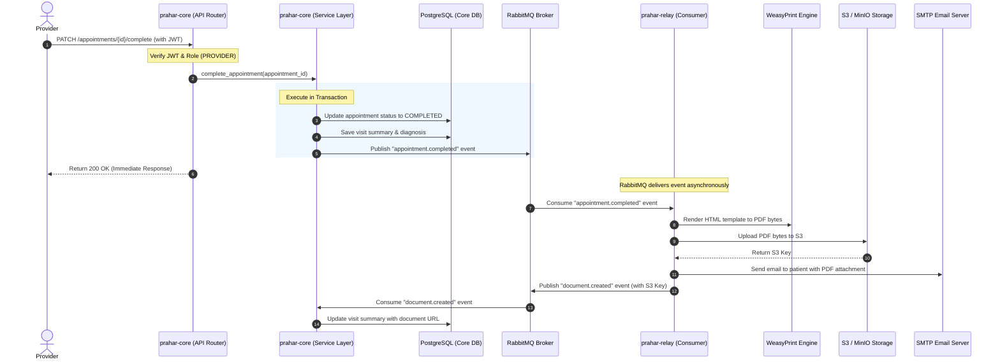

# System Architecture & Event Flow

Prahar Care is built on a microservices-inspired architecture designed for high availability, responsiveness, and separation of concerns. The system is split into two main services: `prahar-core` and `prahar-relay`.

---

## Service Boundaries

### 1. `prahar-core` (Port 8000)
The core service is the source of truth for all clinical and administrative data. It handles:
* **User Management & Auth**: Registration, login, and Role-Based Access Control (RBAC).
* **Clinical Workflows**: Patient records, provider profiles, appointment scheduling, and prescriptions.
* **AI Capabilities**: Retrieval-Augmented Generation (RAG) and the tool-calling clinical agent.
* **Database**: Direct access to the primary PostgreSQL database (including `pgvector` for clinical embeddings).
* **Cache**: Redis for API rate limiting.

### 2. `prahar-relay` (Port 8001)
The relay service handles asynchronous, resource-intensive, or external-facing tasks. It handles:
* **Document Generation**: Rendering HTML templates to PDF using WeasyPrint.
* **Object Storage**: Uploading generated documents to S3/MinIO and generating pre-signed URLs.
* **Notifications**: Sending emails to patients and providers via SMTP.
* **Scheduled Jobs**: Celery Beat scheduler for sending automated appointment reminders.
* **Database**: A separate, isolated database for tracking reminder logs and task states. It does **not** access the core database.

---

## Core Architectural Rule

> **Rule:** Any operation that blocks the user must be synchronous and fast. Any operation that can fail due to external factors (e.g., SMTP server down, S3 latency) must be asynchronous.

For example, completing an appointment should not fail or hang because the email server is slow or down. The core service completes the appointment in the database, publishes an event, and immediately returns a `200 OK` response to the provider. The relay service consumes the event and handles the PDF generation and email delivery in the background.

---

## Event-Driven Workflow Example: Appointment Completion

The diagram below illustrates the end-to-end flow when a provider completes an appointment:



---

## Codebase Layering (Inside Services)

To maintain clean code and testability, both services enforce strict layering:

```
┌─────────────────────────────────────────────────────────┐
│                      API Router                         │
│  - Handles HTTP requests/responses                      │
│  - Validates input schemas (Pydantic)                   │
│  - Injects dependencies (Auth, DB Session)              │
└──────────────────────────┬──────────────────────────────┘
                           │
                           v
┌─────────────────────────────────────────────────────────┐
│                    Service Layer                        │
│  - Implements business logic and validation rules       │
│  - Manages database transactions                        │
│  - Publishes events to RabbitMQ                         │
└──────────────────────────┬──────────────────────────────┘
                           │
                           v
┌─────────────────────────────────────────────────────────┐
│                  Repository Layer                       │
│  - Performs raw database queries (SQLAlchemy)           │
│  - No business logic or conditional rules               │
└──────────────────────────┬──────────────────────────────┘
                           │
                           v
┌─────────────────────────────────────────────────────────┐
│                     Model Layer                         │
│  - Defines database tables and relationships            │
│  - Implements domain behaviors (e.g., state transitions)│
└─────────────────────────────────────────────────────────┘
```

### Layering Guidelines
* **API Router**: Should only contain routing, dependency injection, and schema validation. It must delegate all business logic to the Service Layer.
* **Service Layer**: The orchestrator. It coordinates repositories, performs validations, and triggers side effects (like publishing events).
* **Repository Layer**: Keeps database queries centralized. If a query needs to change, it should only change in the repository, not in the service or router.
* **Model Layer**: Contains the SQLAlchemy models. Domain logic that only depends on the model's state (e.g., checking if an appointment can be completed) should live here.
