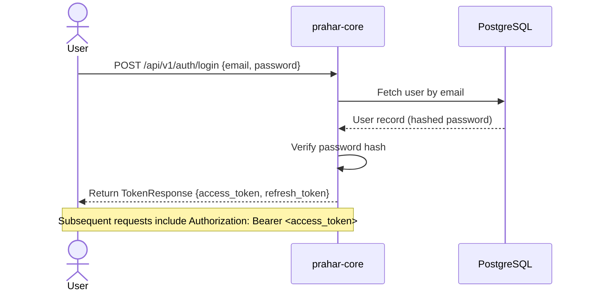

# Authentication & Role-Based Access Control (RBAC)

Prahar Care implements a secure, stateless authentication system using JSON Web Tokens (JWT) and Role-Based Access Control (RBAC) to restrict access to sensitive clinical endpoints.

---

## Authentication Flow

The system uses stateless JWTs to authenticate requests. This allows both `prahar-core` and `prahar-relay` to verify tokens independently using a shared secret key, eliminating the need for a shared session database.



### Token Strategy
* **Access Token**: Short-lived (e.g., 30 minutes). Used to authenticate API requests.
* **Refresh Token**: Long-lived (e.g., 7 days). Used to obtain a new access token without re-entering credentials.

---

## Role-Based Access Control (RBAC)

The system defines three distinct roles:
1. **`patient`**: Can view their own profile, schedule appointments, view their own prescriptions, and interact with the AI assistant.
2. **`provider`**: Can view patient records, manage their availability, conduct appointments, and write prescriptions.
3. **`admin`**: Full access to manage users, system settings, and audit logs.

### Role Definition
Roles are defined as a string enum in `app/models/enums.py`:
```python
import enum

class UserRole(str, enum.Enum):
    PATIENT = "patient"
    PROVIDER = "provider"
    ADMIN = "admin"
```

---

## FastAPI Dependencies

FastAPI's dependency injection system is used to enforce authentication and authorization rules across endpoints.

### 1. `get_current_user`
Extracts the JWT from the `Authorization` header, decodes it, verifies its signature and expiration, and retrieves the user from the database.

```python
async def get_current_user(
    token: str = Depends(oauth2_scheme),
    db: AsyncSession = Depends(get_db)
) -> User:
    payload = decode_token(token)
    user_id = payload.get("sub")
    user = await UserRepository(db).get_by_id(user_id)
    if not user or not user.is_active:
        raise CredentialsError("User is inactive or does not exist")
    return user
```

### 2. `require_role`
A parameterized dependency factory that restricts access to specific roles.

```python
def require_role(*allowed_roles: UserRole):
    def dependency(current_user: User = Depends(get_current_user)) -> User:
        if current_user.role not in [role.value for role in allowed_roles]:
            raise PermissionDeniedError("You do not have permission to access this resource")
        return current_user
    return dependency
```

### Usage in Routers
To protect an endpoint, simply add the dependency to the route definition:

```python
from fastapi import APIRouter, Depends
from app.models.enums import UserRole
from app.core.deps import require_role

router = APIRouter()

# Only providers can create prescriptions
@router.post("/prescriptions", dependencies=[Depends(require_role(UserRole.PROVIDER))])
async def create_prescription(schema: PrescriptionCreate):
    return await prescription_service.create(schema)

# Both providers and admins can view audit logs
@router.get("/audit-logs", dependencies=[Depends(require_role(UserRole.PROVIDER, UserRole.ADMIN))])
async def get_audit_logs():
    return await audit_service.get_all()
```

---

## Security Best Practices

1. **Password Hashing**: Passwords are never stored in plain text. We use `bcrypt` (via `passlib`) to hash passwords before saving them to the database.
2. **Hashed Password Naming**: The database column is named `hashed_password` (not `password`) to prevent accidental exposure or storage of plain text passwords.
3. **Stateless Verification**: The `prahar-relay` service can verify the JWT signature using the same `JWT_SECRET_KEY` without querying the database, keeping the relay service fast and decoupled.
4. **Token Expiration**: Access tokens have a short lifespan to minimize the window of opportunity if a token is compromised.
5. **Role Validation at the Gateway/Router**: Role checks are performed at the router level using dependencies, ensuring that unauthorized requests are rejected before executing any service logic.

---

## Seedha code pe jaate hain.

---

## Step 3 — Auth + RBAC

Teen files banen gi:

```
app/core/security.py   # password hash + JWT
app/core/deps.py       # FastAPI dependencies
app/api/v1/auth.py     # /register /login /me endpoints
app/schemas/auth.py    # request/response shapes
```

---

## 1. `app/schemas/auth.py`

```python
from pydantic import BaseModel, EmailStr
from app.models.enums import UserRole

class RegisterRequest(BaseModel):
    email: EmailStr
    password: str
    full_name: str
    role: UserRole

class LoginRequest(BaseModel):
    email: EmailStr
    password: str

class TokenResponse(BaseModel):
    access_token: str
    token_type: str = "bearer"

class UserRead(BaseModel):
    id: int
    email: str
    full_name: str
    role: UserRole
    is_active: bool

    model_config = {"from_attributes": True}
```

`EmailStr` Pydantic ka built-in validator hai — `abc@` jaisa input turant reject. `from_attributes = True` isliye ki ORM object seedha `UserRead` me convert ho jaye bina manually dict banaye.

---

## 2. `app/core/security.py`

```python
from datetime import timedelta
from functools import lru_cache

from jose import JWTError, jwt
from passlib.context import CryptContext

from app.core.config import get_settings
from app.utils.time import utcnow

pwd_context = CryptContext(schemes=["bcrypt"], deprecated="auto")

def hash_password(plain: str) -> str:
    return pwd_context.hash(plain)

def verify_password(plain: str, hashed: str) -> bool:
    return pwd_context.verify(plain, hashed)

def create_access_token(user_id: int, role: str) -> str:
    settings = get_settings()
    expire = utcnow() + timedelta(
        minutes=settings.access_token_expire_minutes
    )
    return jwt.encode(
        {"sub": str(user_id), "role": role, "exp": expire},
        settings.secret_key,
        algorithm="HS256",
    )

def decode_token(token: str) -> dict:
    settings = get_settings()
    try:
        return jwt.decode(token, settings.secret_key, algorithms=["HS256"])
    except JWTError:
        return {}
```

`bcrypt` kyun — industry standard, intentionally slow (brute force expensive), automatic salt. MD5/SHA256 kabhi mat use karna passwords ke liye — wo fast hain, isliye crackable hain.

`sub` me `user_id` store kar, email nahi — email change ho sakti hai, ID nahi. Ye common mistake hai.

---

## 3. `app/core/deps.py`

```python
from fastapi import Depends, HTTPException, status
from fastapi.security import HTTPAuthorizationCredentials, HTTPBearer
from sqlalchemy.ext.asyncio import AsyncSession

from app.core.security import decode_token
from app.db.session import get_db
from app.models.enums import UserRole
from app.models.user import User
from app.repositories.user import UserRepository

bearer = HTTPBearer()

async def get_current_user(
    credentials: HTTPAuthorizationCredentials = Depends(bearer),
    db: AsyncSession = Depends(get_db),
) -> User:
    token = credentials.credentials
    payload = decode_token(token)

    user_id = payload.get("sub")
    if not user_id:
        raise HTTPException(
            status_code=status.HTTP_401_UNAUTHORIZED,
            detail="Invalid token",
        )

    repo = UserRepository(db)
    user = await repo.get_by_id(int(user_id))

    if not user or not user.is_active or user.deleted_at:
        raise HTTPException(
            status_code=status.HTTP_401_UNAUTHORIZED,
            detail="User not found or inactive",
        )
    return user

def require_role(*roles: UserRole):
    """
    Usage:
        Depends(require_role(UserRole.PROVIDER))
        Depends(require_role(UserRole.PROVIDER, UserRole.ADMIN))
    """
    async def _check(
        current_user: User = Depends(get_current_user),
    ) -> User:
        if current_user.role not in [r.value for r in roles]:
            raise HTTPException(
                status_code=status.HTTP_403_FORBIDDEN,
                detail=f"Access denied. Required: {[r.value for r in roles]}",
            )
        return current_user
    return _check
```

`require_role` factory function hai — ek dependency return karta hai. Isliye ye likhna possible hota hai:

```python
# sirf provider
@router.post("/prescriptions",
    dependencies=[Depends(require_role(UserRole.PROVIDER))])

# provider ya admin dono
@router.delete("/patients/{id}",
    dependencies=[Depends(require_role(UserRole.PROVIDER, UserRole.ADMIN))])
```

Ek jagah likha, 40 endpoints pe lagega. `if user.role != "provider"` har endpoint pe likhega toh ek din ek pe bhoolega — wahi security hole banega.

---

## 4. `app/repositories/user.py`

```python
from sqlalchemy import select
from sqlalchemy.ext.asyncio import AsyncSession

from app.models.user import User

class UserRepository:
    def __init__(self, db: AsyncSession) -> None:
        self.db = db

    async def get_by_id(self, user_id: int) -> User | None:
        result = await self.db.execute(
            select(User).where(
                User.id == user_id,
                User.deleted_at.is_(None),
            )
        )
        return result.scalar_one_or_none()

    async def get_by_email(self, email: str) -> User | None:
        result = await self.db.execute(
            select(User).where(
                User.email == email,
                User.deleted_at.is_(None),
            )
        )
        return result.scalar_one_or_none()

    async def create(self, user: User) -> User:
        self.db.add(user)
        await self.db.flush()
        await self.db.refresh(user)
        return user
```

`flush()` vs `commit()` — `flush()` DB ko bhejta hai par transaction open rakhta hai. `commit()` service layer karega, repository nahi. Agar repository commit kare toh service ke paas rollback ka control nahi rehta.

---

## 5. `app/services/auth.py`

```python
from fastapi import HTTPException, status
from sqlalchemy.ext.asyncio import AsyncSession

from app.core.security import (
    create_access_token, hash_password, verify_password,
)
from app.models.user import User
from app.repositories.user import UserRepository
from app.schemas.auth import LoginRequest, RegisterRequest, TokenResponse

class AuthService:
    def __init__(self, db: AsyncSession) -> None:
        self.repo = UserRepository(db)
        self.db = db

    async def register(self, data: RegisterRequest) -> TokenResponse:
        existing = await self.repo.get_by_email(data.email)
        if existing:
            raise HTTPException(
                status_code=status.HTTP_409_CONFLICT,
                detail="Email already registered",
            )

        user = User(
            email=data.email,
            hashed_password=hash_password(data.password),
            full_name=data.full_name,
            role=data.role.value,
        )
        user = await self.repo.create(user)
        await self.db.commit()

        return TokenResponse(
            access_token=create_access_token(user.id, user.role)
        )

    async def login(self, data: LoginRequest) -> TokenResponse:
        user = await self.repo.get_by_email(data.email)

        if not user or not verify_password(data.password, user.hashed_password):
            raise HTTPException(
                status_code=status.HTTP_401_UNAUTHORIZED,
                detail="Invalid email or password",
            )

        if not user.is_active:
            raise HTTPException(
                status_code=status.HTTP_403_FORBIDDEN,
                detail="Account deactivated",
            )

        return TokenResponse(
            access_token=create_access_token(user.id, user.role)
        )
```

**Login error ek hi message kyun:** "Invalid email or password" — dono case me same. Alag messages dene se attacker pata kar sakta hai ki email exist karta hai ya nahi. Ye **user enumeration attack** hai — production me hamesha same error.

---

## 6. `app/api/v1/auth.py`

```python
from fastapi import APIRouter, Depends
from sqlalchemy.ext.asyncio import AsyncSession

from app.core.deps import get_current_user
from app.db.session import get_db
from app.models.user import User
from app.schemas.auth import (
    LoginRequest, RegisterRequest, TokenResponse, UserRead,
)
from app.services.auth import AuthService

router = APIRouter(prefix="/auth", tags=["auth"])

@router.post("/register", response_model=TokenResponse, status_code=201)
async def register(
    data: RegisterRequest,
    db: AsyncSession = Depends(get_db),
) -> TokenResponse:
    return await AuthService(db).register(data)

@router.post("/login", response_model=TokenResponse)
async def login(
    data: LoginRequest,
    db: AsyncSession = Depends(get_db),
) -> TokenResponse:
    return await AuthService(db).login(data)

@router.get("/me", response_model=UserRead)
async def me(current_user: User = Depends(get_current_user)) -> User:
    return current_user
```

Router me sirf HTTP hai — koi business logic, koi DB query. Seedha service ko delegate.

---

## 7. `app/main.py` me router add kar

```python
from app.api.v1.auth import router as auth_router
app.include_router(auth_router, prefix="/api/v1")
```

---

## Test kar

```bash
# Register
curl -X POST http://localhost:8000/api/v1/auth/register \
  -H "Content-Type: application/json" \
  -d '{"email":"dr.sharma@swiftcare.io","password":"secret123","full_name":"Dr Sharma","role":"provider"}'

# Response
{"access_token": "eyJ...", "token_type": "bearer"}

# Login
curl -X POST http://localhost:8000/api/v1/auth/login \
  -H "Content-Type: application/json" \
  -d '{"email":"dr.sharma@swiftcare.io","password":"secret123"}'

# Me
curl http://localhost:8000/api/v1/me \
  -H "Authorization: Bearer eyJ..."
```

---

## Common mistakes yahan

1. `commit()` repository me karna — service ka rollback control chala jaata hai
2. Login pe alag error — user enumeration
3. `sub` me email rakhna — email change hoti hai, ID nahi
4. `require_role` ke baad bhi manually `if user.role` check karna — double check nahi, trust kar dependency ko
5. Token me sensitive data rakhna (password, SSN) — JWT sirf base64 encoded hai, encrypted nahi, koi bhi decode kar sakta hai

## Interview questions

- JWT stateless kyun? (Do services — core aur relay — dono verify kar sakte hain bina shared DB ke)
- Refresh token kyun nahi banaya? (Short expiry + re-login. Production me zaroor hoga — par assignment ke scope me nahi)
- `require_role` factory function kyun, direct dependency kyun nahi? (Multiple roles support — `require_role(PROVIDER, ADMIN)`)
- Bcrypt me `deprecated="auto"` kya karta hai? (Naya algo aaya toh purane hashes auto-upgrade honge verify ke waqt)

---

Ye chal gaya toh **step 4 — Patients + Providers CRUD** pe jaate hain jahan repository pattern properly wire hoga.
