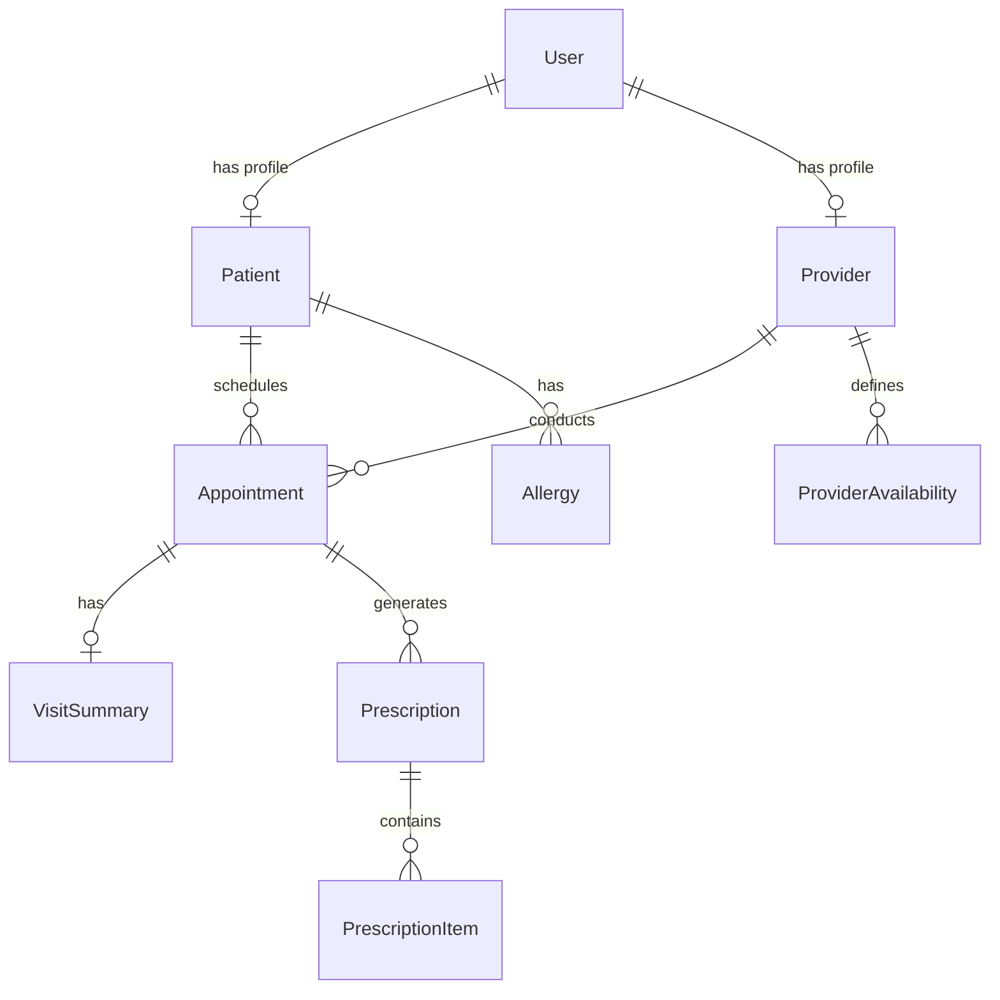

# Database Design & Migrations

Prahar Care uses PostgreSQL 16 as its primary relational database. Database interactions are managed asynchronously using SQLAlchemy 2.0, and schema migrations are handled via Alembic.

A complete Database Markup Language (DBML) specification of the schema is available in [`db_architecture.dbml`](db_architecture.dbml).

---

## Data Models & Relationships

The database schema is designed around the core entities: `User`, `Patient`, `Provider`, `Appointment`, `Prescription`, and `VisitSummary`.



### Key Models

1. **`User`**: Base table for authentication. Contains credentials, full name, and role (`patient`, `provider`, `admin`).
2. **`Patient`**: Extends `User` with patient-specific details (date of birth, blood group, address). Linked via a one-to-one relationship.
3. **`Provider`**: Extends `User` with provider-specific details (specialization, license number, consultation fee).
4. **`ProviderAvailability`**: Defines weekly availability slots for providers (e.g., Mondays 09:00 - 17:00).
5. **`Appointment`**: Connects a patient and a provider. Uses polymorphic inheritance to distinguish between `in_person` and `telehealth` appointments.
6. **`VisitSummary`**: Stores the diagnosis, vitals (stored as JSONB), and follow-up date for a completed appointment.
7. **`Prescription`**: Contains prescription metadata and links to multiple `PrescriptionItem` records.
8. **`Allergy`**: Tracks patient allergies for safety checks during prescription creation.

---

## Soft Delete

To comply with medical record regulations, hard-deleting clinical data is illegal. Prahar Care implements soft deletes using a `SoftDeleteMixin`.

### Implementation

```python
class SoftDeleteMixin:
    deleted_at: Mapped[datetime | None] = mapped_column(
        DateTime(timezone=True), nullable=True, index=True
    )

    @property
    def is_deleted(self) -> bool:
        return self.deleted_at is not None
```

### Repository-Level Filtering
To prevent deleted records from appearing in queries, the repository layer must apply a default filter:
```python
# Example query in PatientRepository
stmt = select(Patient).where(Patient.deleted_at.is_none())
```
This ensures soft delete logic is centralized in the repository layer rather than being manually added to every API endpoint.

---

## Polymorphic Inheritance (Appointments)

Appointments can be either **In-Person** or **Telehealth**. Instead of creating separate tables or using complex joins, we use SQLAlchemy's **Single-Table Inheritance (STI)**.

* All appointments are stored in a single `appointments` table.
* A discriminator column `appointment_type` determines the subclass.
* Specific columns (like `room_number` for in-person and `meeting_link` for telehealth) are nullable and populated based on the type.

### Implementation

```python
class Appointment(Base, TimestampMixin, SoftDeleteMixin):
    __tablename__ = "appointments"

    id: Mapped[int] = mapped_column(primary_key=True)
    appointment_type: Mapped[str] = mapped_column(String(20), nullable=False)
    status: Mapped[str] = mapped_column(String(20), default=AppointmentStatus.SCHEDULED.value)
    
    # ... common columns ...

    __mapper_args__ = {
        "polymorphic_on": "appointment_type",
        "polymorphic_identity": "base",
    }

class InPersonAppointment(Appointment):
    room_number: Mapped[str | None] = mapped_column(String(20))

    __mapper_args__ = {
        "polymorphic_identity": "in_person",
    }

class TelehealthAppointment(Appointment):
    meeting_link: Mapped[str | None] = mapped_column(String(500))

    __mapper_args__ = {
        "polymorphic_identity": "telehealth",
    }
```

When querying `session.get(Appointment, id)`, SQLAlchemy automatically instantiates the correct subclass (`InPersonAppointment` or `TelehealthAppointment`) based on the `appointment_type` column.

---

## Database-Level Exclusion Constraints

To prevent double-booking, the database enforces a strict exclusion constraint on the `appointments` table. This prevents any two active appointments for the same provider from overlapping in time.

### The Constraint
We use PostgreSQL's `EXCLUDE` constraint with the `gist` index type. It checks that for any two rows:
1. The `provider_id` is equal (`=`).
2. The scheduled time ranges overlap (`&&`).
3. The constraint only applies to active, non-deleted appointments (`status NOT IN ('cancelled', 'no_show') AND deleted_at IS NULL`).

### Alembic Migration Setup
Since SQLAlchemy does not natively generate exclusion constraints in autogenerated migrations, we add it manually to the migration script:

```python
def upgrade() -> None:
    # 1. Enable the btree_gist extension required for mixing scalar and range types
    op.execute("CREATE EXTENSION IF NOT EXISTS btree_gist")
    
    # 2. Add the exclusion constraint
    op.execute("""
        ALTER TABLE appointments
        ADD CONSTRAINT ex_appt_no_provider_overlap
        EXCLUDE USING gist (
            provider_id WITH =,
            tstzrange(scheduled_start, scheduled_end) WITH &&
        )
        WHERE (status NOT IN ('cancelled', 'no_show') AND deleted_at IS NULL)
    """)

def downgrade() -> None:
    op.execute("ALTER TABLE appointments DROP CONSTRAINT ex_appt_no_provider_overlap")
```

---

## Schema Migrations with Alembic

### Rules for Schema Evolution
1. **Never use `Base.metadata.create_all(engine)` in production.** Always use Alembic migrations to apply schema changes.
2. **Verify migrations locally.** Run migrations against a local database and verify that rollback (`downgrade`) works without data loss.
3. **Handle existing data.** When adding a new non-nullable column, provide a default value or perform the migration in steps (add nullable -> populate data -> set nullable to false).

### Common Commands

* **Generate a new migration:**
  ```bash
  docker compose exec core-api alembic revision --autogenerate -m "description of changes"
  ```
* **Apply migrations to the database:**
  ```bash
  docker compose exec core-api alembic upgrade head
  ```
* **Rollback the last migration:**
  ```bash
  docker compose exec core-api alembic downgrade -1
  ```
