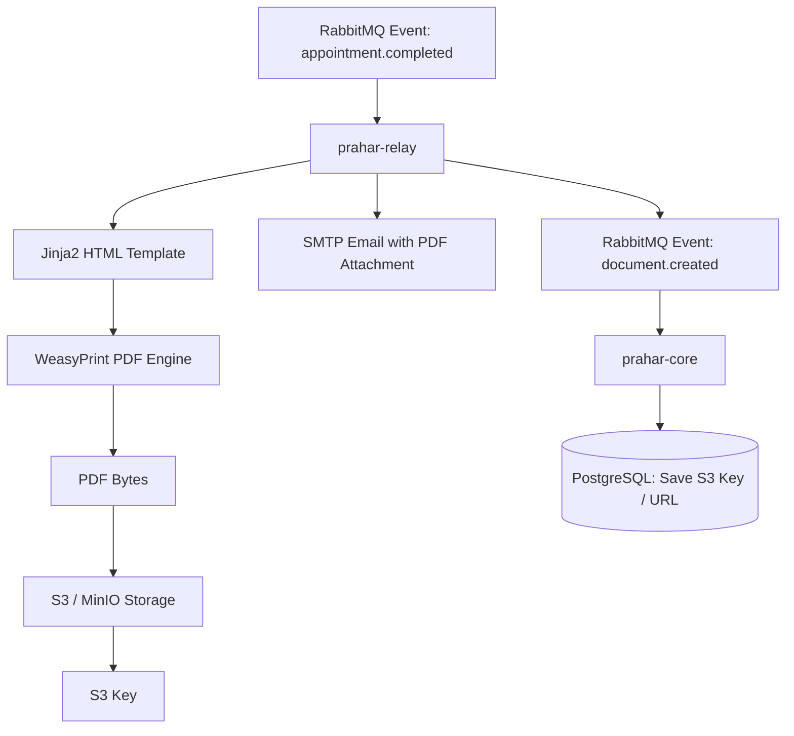
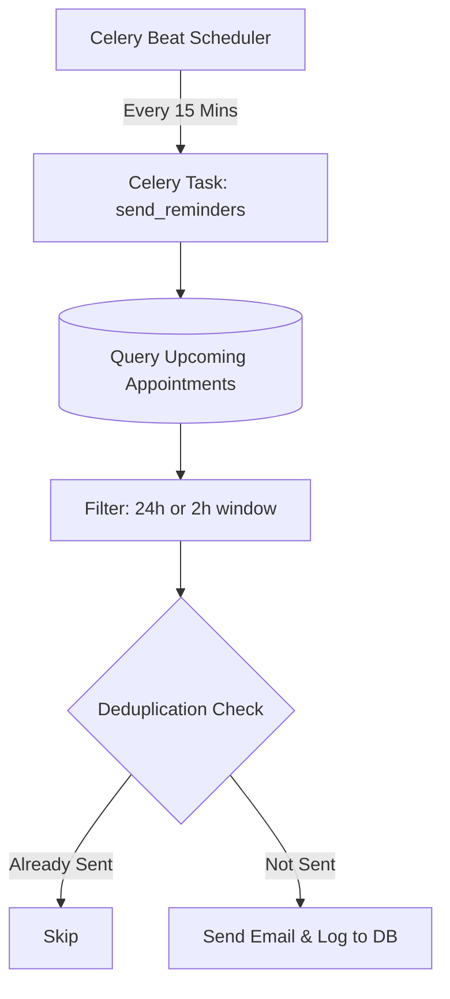

# Reminders & Document Generation

Prahar Care uses an asynchronous, event-driven architecture to handle document generation, storage, and scheduled reminders. These tasks are offloaded to the `prahar-relay` service to keep the core API fast and responsive.

---

## Document Generation Flow

When an appointment is completed or a prescription is written, the system generates a PDF document. The file bytes are never returned directly to the client; instead, they are stored in S3 (or MinIO locally), and a secure, pre-signed URL is returned.



### 1. PDF Rendering (WeasyPrint)
WeasyPrint converts HTML templates (styled with CSS) into high-quality PDFs.
```python
# prahar-relay/app/documents/renderer.py
from weasyprint import HTML

def render_visit_summary_pdf(data: dict) -> bytes:
    html_content = render_template("visit_summary.html", data)
    return HTML(string=html_content).write_pdf()
```

### 2. Storage (S3 / MinIO)
The generated PDF bytes are uploaded to S3. To view the document, the system generates a pre-signed URL with a short expiration time (e.g., 15 minutes) to ensure security.
```python
# prahar-relay/app/storage/s3.py
import boto3

def upload_document(file_bytes: bytes, key: str) -> str:
    s3_client = boto3.client("s3")
    s3_client.put_object(Bucket="prahar-documents", Key=key, Body=file_bytes)
    return key

def get_presigned_url(key: str, expires_in: int = 900) -> str:
    s3_client = boto3.client("s3")
    return s3_client.generate_presigned_url(
        "get_object",
        Params={"Bucket": "prahar-documents", "Key": key},
        ExpiresIn=expires_in
    )
```

---

## RabbitMQ Event-Driven Communication

The `prahar-core` and `prahar-relay` services communicate asynchronously using RabbitMQ.

### Event Contracts
To ensure type safety and consistency, both services share a common package or module containing Pydantic event schemas:
```python
# prahar-contracts/events.py
from pydantic import BaseModel

class AppointmentCompletedEvent(BaseModel):
    appointment_id: int
    patient_id: int
    provider_id: int
    diagnosis: str
    patient_email: str

class DocumentCreatedEvent(BaseModel):
    appointment_id: int
    document_type: str
    s3_key: str
```

### Flow
1. **`prahar-core`** publishes `AppointmentCompletedEvent` to the `appointment.completed` exchange.
2. **`prahar-relay`** consumes the event, renders the PDF, uploads it to S3, sends the email, and publishes `DocumentCreatedEvent` to the `document.created` exchange.
3. **`prahar-core`** consumes `DocumentCreatedEvent` and updates the database with the document's S3 key.

---

## Celery Beat Scheduled Reminders

Patients receive automated email reminders before their scheduled appointments (e.g., 24 hours and 2 hours prior).



### Idempotency & Deduplication
To prevent sending duplicate emails (e.g., if a task is retried or runs twice), `prahar-relay` uses a dedicated database table `reminder_logs` with a unique constraint on `(appointment_id, reminder_type)`.

```python
# prahar-relay/app/models/reminder_log.py
class ReminderLog(Base):
    __tablename__ = "reminder_logs"
    
    id: Mapped[int] = mapped_column(primary_key=True)
    appointment_id: Mapped[int] = mapped_column(nullable=False)
    reminder_type: Mapped[str] = mapped_column(String(20), nullable=False) # "24h" or "2h"
    sent_at: Mapped[datetime] = mapped_column(default=utcnow)
    
    __table_args__ = (
        UniqueConstraint("appointment_id", "reminder_type", name="uq_appointment_reminder"),
    )
```

### Task Execution
The Celery task attempts to insert a log record before sending the email. If the insert fails due to a unique constraint violation, the task knows the email has already been sent and exits immediately.

```python
# prahar-relay/app/tasks/reminders.py
@celery_app.task
def send_appointment_reminders():
    upcoming_appointments = query_upcoming_appointments()
    
    for appt in upcoming_appointments:
        reminder_type = determine_reminder_type(appt.scheduled_start)
        if not reminder_type:
            continue
            
        # Attempt to acquire lock/log the reminder
        try:
            db.add(ReminderLog(appointment_id=appt.id, reminder_type=reminder_type))
            db.commit() # Unique constraint will fail here if already sent
        except IntegrityError:
            db.rollback()
            continue # Skip sending email
            
        # Send the email
        send_email(
            to=appt.patient_email,
            subject=f"Reminder: Upcoming Appointment at {appt.scheduled_start}",
            body=f"Hello, this is a reminder for your appointment..."
        )
```
This database-level lock ensures that even if multiple Celery workers execute the task concurrently, each reminder is sent exactly once.
